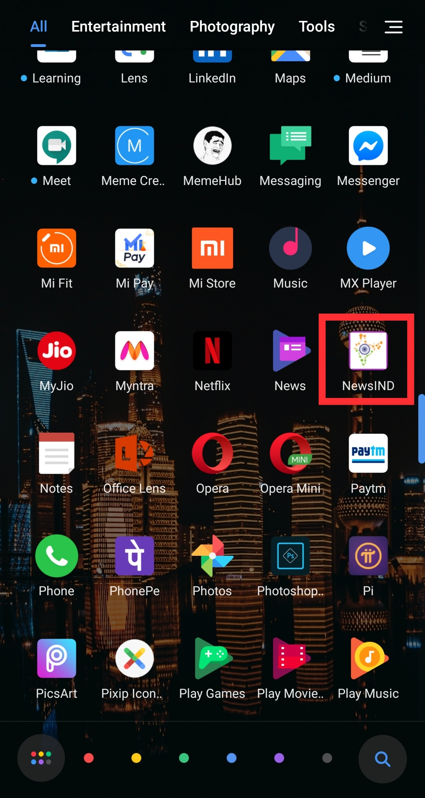

# NewsIND (Android App)
NewsIND is a news feeding Android App with multiple catagories of news section build on Android Studio using Kotlin.

NewsIND is created on an empty activity of Android Studio using the official language Kotlin. Here the concepts of intent, recycler view & API call are used. Volley & Glide libraries are also used during the API Call.
Multiple APIs are called here due to different catagories of news sections. Chrome Custom Tabs are used to view the full article of a specific news in the app so that the user remains inside the app throughout the uses time.
This is a project based application using APIs from newsapi.org. This app is not pubished in playstore. APIs that are used here are for project based and are not to engage in any commercial purposes.

However if you choose to use this app, you can download it from the link below. 

https://drive.google.com/file/d/1EBmFtZYYzxd_Nha2QixAANKF1TC-htiF/view?usp=sharing  (Version 1.0)

https://drive.google.com/file/d/12APwax1b9V55LPyH-STSDpVHTCh685AA/view?usp=sharing  (Updated version - Fixed ActionBar on SplashScreen)

The above gif is from the updated version of this app.

Some screenshots from the previous version of this app are attached. 

 
 
 
